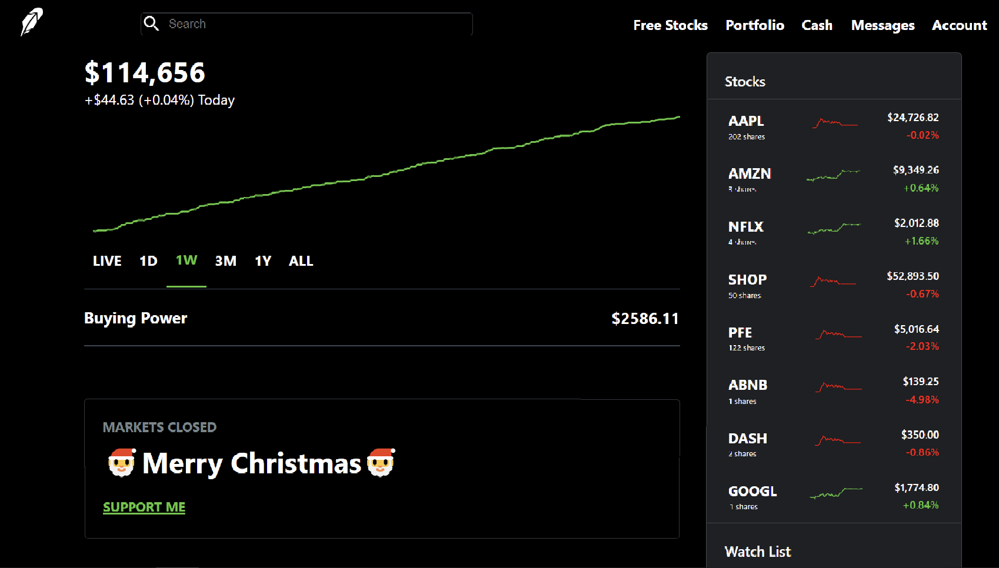

# StockSail: Navigating Investments(Robinhood Clone)  

# StockSail: Simplified Stock Market App

1. **Virtual Balance**: Start with a $10,000 virtual balance for investment simulations.
2. **Simple Investments**: Make $1,000 investments in virtual stocks with just one click.
3. **Investment Tracking**: Automatically track all your investments and balance updates.
4. **User-Friendly Interface**: Designed for easy navigation and simplicity.
5. **Quick Setup**: Minimal steps required to get started with the app.
6. **Open Source**: Freely available for modification and enhancement.
7. **Clone the Repository**: Use `git clone'
8. **Install Dependencies**: Run `npm install` in the project directory.
9. **Launch the App**: Execute `npx react-native run-android` or `npx react-native run-ios` depending on your target platform.
10. **Contribute**: Contributions are welcome! Fork the project and submit pull requests with improvements or new features.

Invest in your financial education with InvestmentNavigator - a platform for learning stock market basics without real-world risks.
